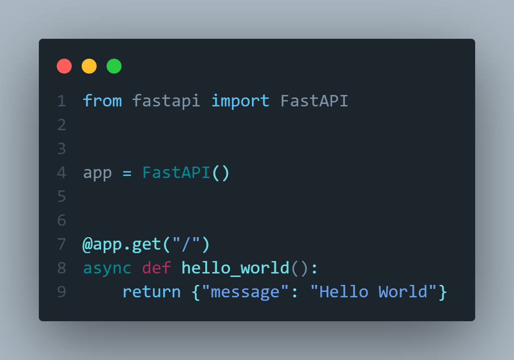
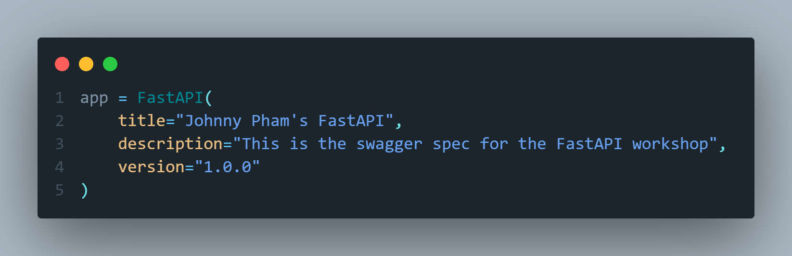
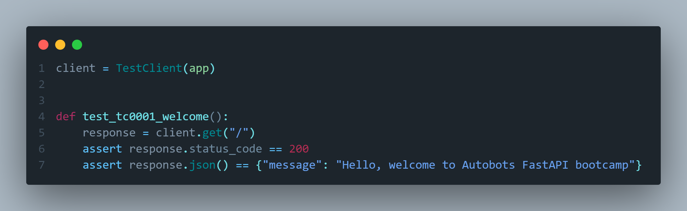
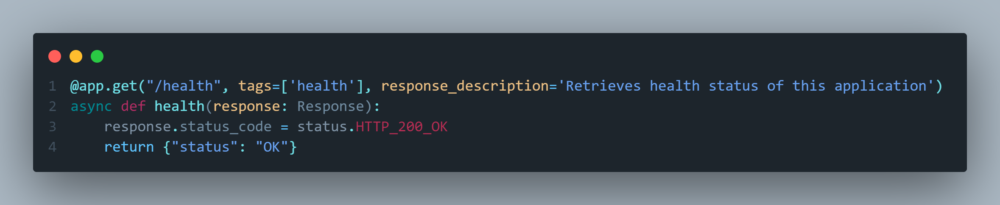
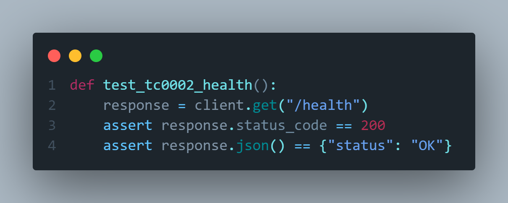
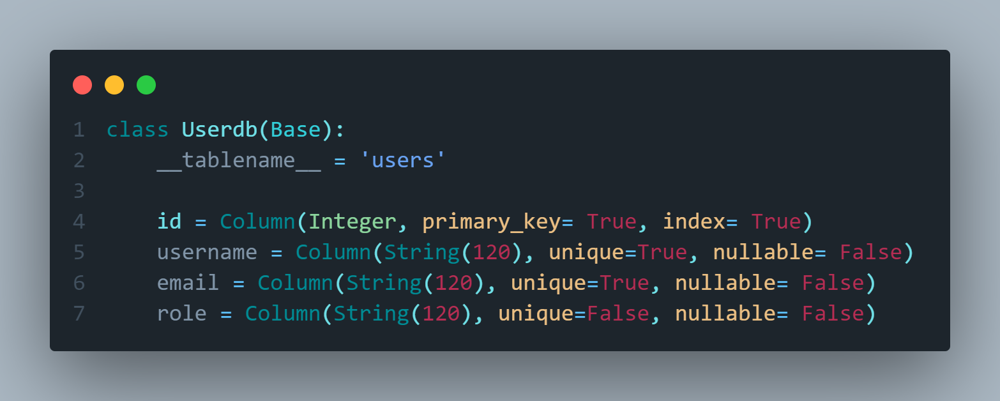
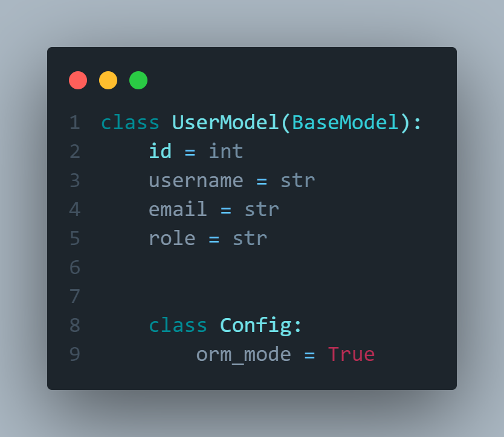
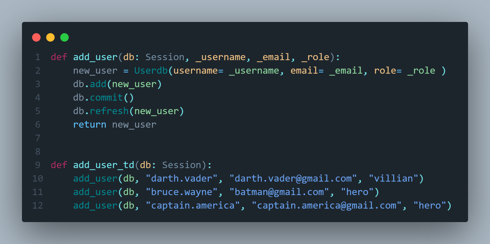

# Fast-api-v1
rewriting enterprise level fast-api

## commands used for setup 
- Setup 

    - py -3 -m venv venv 

    - . venv/Scripts/activate 

    - pip install fastapi 

    - pip install uvicorn 

    - pip freeze > requirements.txt

- Pytest

    - pip install pytest

    - pip install httpx

- Sqlalchemy

    pip install sqlalchemy

## Initial commit 
is to have the venv installed and updated readme

## Added requirements.txt
adding a file called requirements.txt for dependency management

## Created main.py file
created main.py file to run endpoint and test to make sure our code runs

## Swagger spec documentation
swagger ui is included in FastAPI meaning we don't have to write it out from scratch like Flask

## Created app_test.py in tests folder 
testing welcome path op

## Created health enpoint and created a test for this endpoint

## Installed sqlalchemy dependency and created a db_config file for database connection

## Creating users data table 
id column is generated after the other 2 fields are entered
primary key makes it easier for us to find the user
string(#) will alow how many characters are entered
unique ensuring there is one 1 particular value in the database
nullable meaning this field is required 

## Created schema.py
this is for when someone is entering data, the data will be bumped against the schema to make sure all fields are present before interacting with the database

orm stands for object realational mapping

## Created user_repository.py file
this file will have the functions we need to interact with the database
this will also have a test data function for testing

